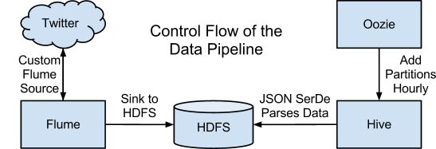

# cps853_a2
A repository for Building Big Data Systems Assignment 2

## Data Links
- Group members: <a target="blank" href="https://dmitrymakhnin.github.io/cps853_a2/group.xml">Click Here</a>  
- Open issues: <a target="blank" href="https://github.com/dmitrymakhnin/cps853_a2/issues?q=is%3Aopen+is%3Aissue">Click Here</a>  
- Closed issues: <a target="blank" href="https://github.com/dmitrymakhnin/cps853_a2/issues?q=is%3Aissue+is%3Aclosed">Click Here</a>

## Assignment Direct Links
- <a target="blank" href="http://blog.cloudera.com/blog/2012/09/analyzing-twitter-data-with-hadoop/">How-to: Analyze Twitter Data with Apache Hadoop</a>
- <a target="blank"  href="http://blog.cloudera.com/blog/2012/10/analyzing-twitter-data-with-hadoop-part-2-gathering-data-with-flume/#comment-48910">Analyzing Twitter Data with Apache Hadoop, Part 2: Gathering Data with Flume</a>
- <a target="blank"  href="http://blog.cloudera.com/blog/2012/11/analyzing-twitter-data-with-hadoop-part-3-querying-semi-structured-data-with-hive/">Analyzing Twitter Data with Apache Hadoop, Part 3: Querying Semi-structured Data with Apache Hive</a>
- <a target="blank"  href="http://blog.cloudera.com/blog/2013/03/how-to-analyze-twitter-data-with-hue/">How-to: Analyze Twitter Data with Hue</a>

## Assignment Indirect Links
- <a href="https://github.com/cloudera/cdh-twitter-example" target="blank">CDH Twitter Example on GitHub</a>
